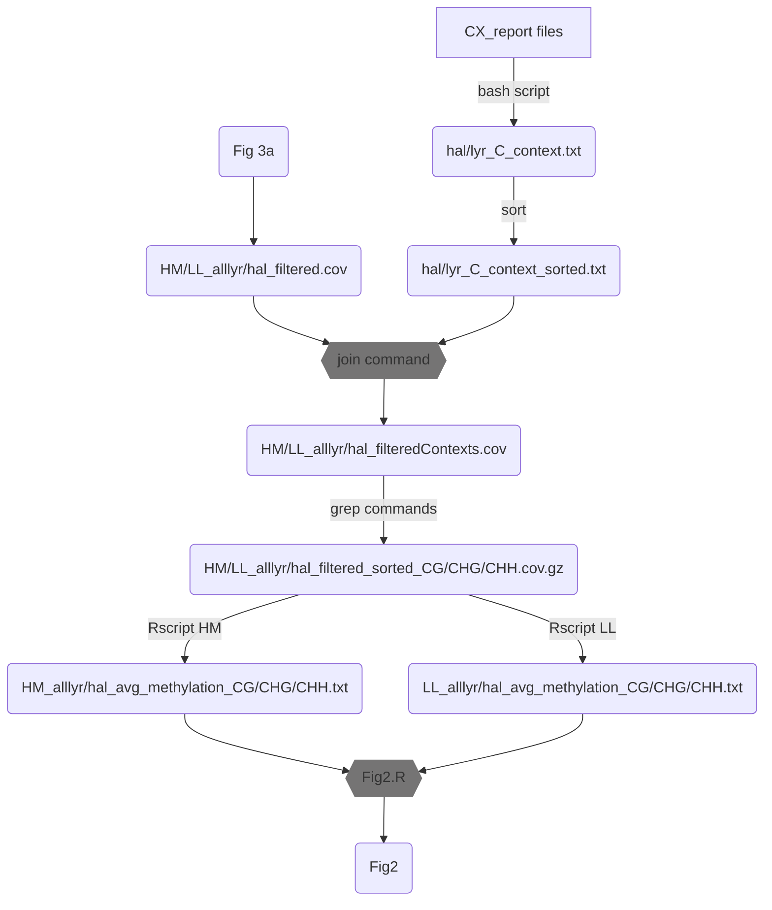

# Pipeline for circlize plot



## Details on scripts and commands

### bash script and sort

For this step we select any CX file: one from halleri (`1.*CX_report.txt.gz`) and one from lyrata (`2.*CX_report.txt.gz`) sides. We create a general index showing the context for each C in the genome as follows:

```bash
zcat hal/lyr.CX_report.txt.gz | awk -F'\t' '{print $1"_"$2"_"$2"\t"$6}' > hal/lyr_C_context.txt
```
Afterwards we sort the index file as follows:

```bash
sort hal/lyr_C_context.txt > halleri/lyrata_C_context_sorted.txt
```

### join command

With the index file sorted we can merge it with the allhal/alllyr [files from Fig3a](https://figshare.com/projects/Data_for_MDS_analyses/134765) containing information on overlapping Cs across all samples:

```bash
join HM/LL_alllyr/hal_filtered.cov halleri/lyrata_C_context_sorted.txt > HM/LL_alllyr/hal_filteredContexts.cov
```

### grep commands

For the final `circlize` plot we need (methylation) context-specific information, so we run the following command to get context-specific files (`pigz` can be replaced by `gzip` or any `gz` compression tool):

```bash
grep "CG" HM/LL_alllyr/hal_filteredContexts.cov | pigz > HM/LL_alllyr/hal_filtered_sorted_CG.cov.gz
grep "CHG" HM/LL_alllyr/hal_filteredContexts.cov | pigz > HM/LL_alllyr/hal_filtered_sorted_CHG.cov.gz
grep "CHH" HM/LL_alllyr/hal_filteredContexts.cov | pigz > HM/LL_alllyr/hal_filtered_sorted_CHH.cov.gz
```

### Rscripts HM and LL

We use the `circlize_meth` Rscripts to obtain the average methylation level across replicates for all of our samples. One script (`HM`) is for mild conditions and the other (`LL`) is for stress conditions.
Both scripts are meant to be used via the command-line as follows:

HM
```bash
# CLI arguments: 1) input, 2) parent side and 3) output name
# halleri side
Rscript circlize_meth_CL_HM.R HM_allhal_filtered_sorted_CG/CHG/CHH.cov.gz "hal" HM_allhal_avg_methylation_CG/CHG/CHH.txt
# lyrata side
Rscript circlize_meth_CL_HM.R HM_alllyr_filtered_sorted_CG/CHG/CHH.cov.gz "lyr" HM_alllyr_avg_methylation_CG/CHG/CHH.txt
```

LL
```bash
# CLI arguments: 1) input, 2) parent side and 3) output name
# halleri side
Rscript circlize_meth_CL_LL.R LL_allhal_filtered_sorted_CG/CHG/CHH.cov.gz "hal" LL_allhal_avg_methylation_CG/CHG/CHH.txt
# lyrata side
Rscript circlize_meth_CL_LL.R LL_alllyr_filtered_sorted_CG/CHG/CHH.cov.gz "lyr" LL_alllyr_avg_methylation_CG/CHG/CHH.txt
```

Note: you can create a script to loop through the files

### Fig2.R

The figure script is meant to be used interactively via Rstudio. In order for it to run, make sure to change the following lines (10-12) of the script:

```
# Import data

data <- "/path/to/data"
```