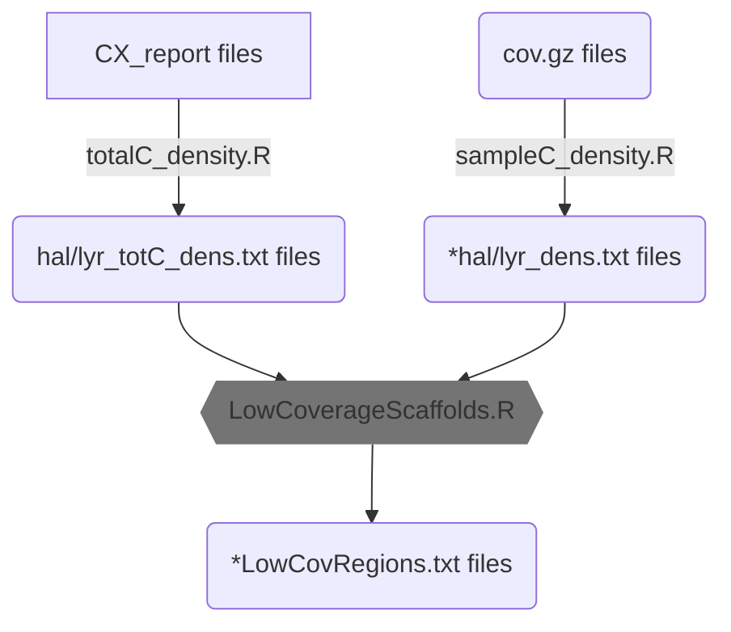

# Low coverage regions pipeline

The idea behind this pipeline is to compute the average cytosine (C) coverage over 100kb windows along the genome (referred to as density) in our _A. kamchatica_ synthetic individuals. In order to do so, on one hand we count the number of C in each 100kb window of the genome (1) and on the other we count the total C coverage for these windows (2). By dividing (2) by (1), we will obtain the average cytosine coverage. To find low coverage regions, we simply check all windows with density < 2, meaning average coverage less than 2X. 

The pipeline looks as follows:



### sampleC_density.R

This command line script is for computing sample cytosine coverage. It needs to be set up as follows:

```
Rscript sampleC_density.R [1] [2] [3]
```

[1]: Bismark `cov.gz` file for synthetic _A. kamchatica_ (`HM/LL_RS7_G1/4`) that can be found [here](https://doi.org/10.5281/zenodo.7323783)
[2]: Parental side, either `"hal"` or `"lyr"`
[3]: Full output name such as `HM_RS7_G4_1_hal_dens.txt`

### totalC_density.R

This command line script is for computing total cytosine coverage. This script needs to be run only twice: one for each progenitor side. It needs to be set up as follows:

Libraries required: `data.table` and `GenomicRanges`

```
Rscript totalC_density.R [1] [2] [3]
```

[1]: Bismark `CX` file that can be found  [here](https://doi.org/10.5281/zenodo.7695685)
[2]: Parental side, either `"hal"` or `"lyr"`
[3]: Full output name such as `hal_totC_dens.txt` or `lyr_totC_dens.txt`

### LowCoverageScaffolds.R

This interactive Rscript where line 19 and 114 need to be changed according to the input and output folder respectively. The files for this script are available in the `density_files` folder. 